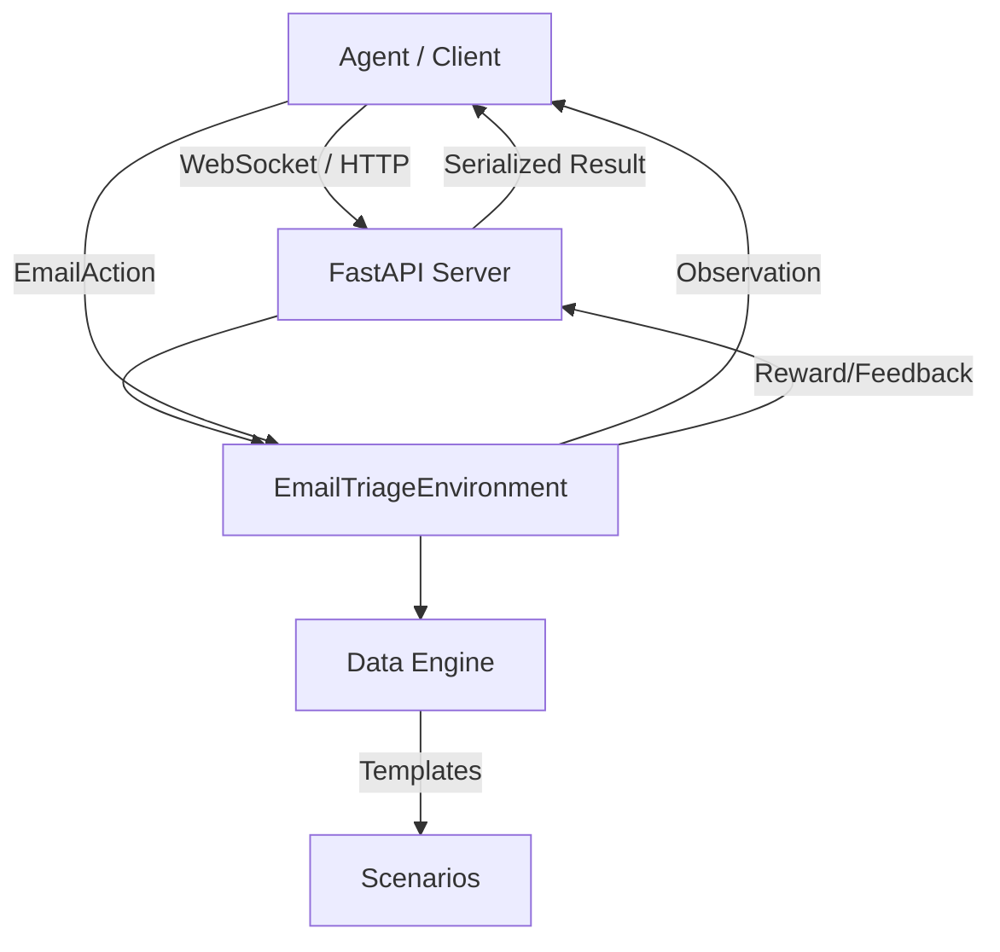

# Email Triage Environment

[](https://github.com/meta-pytorch/OpenEnv)
[](https://python.org)
[](LICENSE)

Email Triage is a high-stakes knowledge-work task. Getting it wrong means missed customer crises, ignored security alerts, and lost revenue.

This environment provides an [OpenEnv](https://github.com/meta-pytorch/OpenEnv)-compatible RL playground to train agents on classifying, ranking, and responding to emails with dense, verifiable reward signals.

---

## Motivation

An executive assistant processes 50–200 emails per day. Getting prioritisation wrong means:
- Missed customer crises → churn
- Ignored security alerts → breaches
- Overlooked contract renewals → lost revenue

This environment lets agents learn from dense reward signals on a task with clear, verifiable ground truth — unlike open-ended generation tasks.

---

## Quick Start

### Option 1 — local (fastest for development)

```bash
git clone https://github.com/YOUR_USERNAME/email-triage-env
cd email-triage-env
pip install -e .

# Start the server
PORT=8000 python -m server.app

# Interact from another terminal
python - <<'EOF'
from client import EmailTriageEnv
from server.models import EmailAction

def main():
    with EmailTriageEnv("http://localhost:8000") as env:
        result = env.reset(task_id="easy")
        obs = result.observation
        print(f"Email: {obs.single_email.subject}")

        result = env.step(EmailAction(
            action_type="classify",
            email_id=obs.single_email.id,
            urgency="urgent",
            priority=5,
        ))
        print(f"Reward: {result.reward}")
        print(f"Feedback: {result.observation.last_action_feedback}")

if __name__ == "__main__":
    main()
EOF
```

### Option 2 — Docker

```bash
docker build -t email-triage-env .
docker run -p 8000:7860 email-triage-env

# Swagger docs at http://localhost:8000/docs
```

### Option 3 — Hugging Face Spaces

```python
from client import EmailTriageEnv
env = EmailTriageEnv("https://YOUR_USERNAME-email-triage-env.hf.space")
```

---

## System Architecture



## Environment Description

The environment simulates a corporate inbox. Each episode loads a fresh set of emails
generated from a pool of 15 realistic templates covering outages, invoices, customer
complaints, sales deals, HR notices, and spam.

Three tasks of increasing difficulty are available. The agent selects a task via the
`task_id` reset parameter.

---

## Tasks

| Task | ID | Difficulty | Max Steps | Pass | Excellent |
|---|---|---|---|---|---|
| Single Email Classification | `easy` | Easy | 5 | ≥ 0.70 | ≥ 0.90 |
| Inbox Priority Ranking | `medium` | Medium | 8 | ≥ 0.60 | ≥ 0.85 |
| Full Triage Pipeline | `hard` | Hard | 10 | ≥ 0.55 | ≥ 0.80 |

### Easy — Single Email Classification
The agent receives one email and must classify it with `action_type="classify"`:
- `urgency`: `urgent` / `normal` / `low` / `spam`
- `priority`: integer 1 (lowest) to 5 (highest)

Episodes end after one classification action.

### Medium — Inbox Priority Ranking
The agent receives an inbox of 10 emails and must sort them by priority using
`action_type="rank"` with a `ranked_ids` list (most urgent first).

The agent may submit multiple rankings across steps and receives Kendall-tau feedback
after each submission. Episodes auto-complete when tau ≥ 0.95.

### Hard — Full Triage Pipeline
The agent receives one urgent email and must submit `action_type="triage"` with all fields:
- `urgency` + `priority` — classification
- `reply_draft` — a professional reply (minimum ~50 words)
- `route_to` — `support` / `sales` / `engineering` / `hr` / `finance` / `general`

---

## Technical Specifications

### Action Space

The `EmailAction` Pydantic model defines the agent's interaction interface.

| Field | Type | Required For | Description |
| :--- | :--- | :--- | :--- |
| `action_type` | `str` | All | One of: `"classify"`, `"rank"`, `"triage"`, `"done"` |
| `email_id` | `str` | `classify`, `triage` | The unique ID of the target email |
| `urgency` | `Enum` | `classify`, `triage` | `urgent`, `normal`, `low`, `spam` |
| `priority` | `int` | `classify`, `triage` | Integer scale 1 (lowest) to 5 (highest) |
| `ranked_ids` | `list` | `rank` | List of all email IDs in priority order |
| `reply_draft` | `str` | `triage` | Professional email response (min 50 words) |
| `route_to` | `Enum` | `triage` | Target: `support`, `sales`, `engineering`, `hr`, `finance`, `general` |

### Observation Space

The `EmailObservation` provides the raw data and state for the agent.

| Field | Type | Description |
| :--- | :--- | :--- |
| `task_id` | `str` | current task identifier (`easy`, `medium`, `hard`) |
| `single_email` | `dict` | Full email data (id, subject, sender, body, meta) |
| `inbox` | `list` | List of email objects (for Ranking task) |
| `last_action_feedback` | `str` | Plain-text explanation of the previous step's reward |
| `done` | `bool` | Termination flag |
| `cumulative_reward` | `float` | Running total for the current episode |
| `step_count` | `int` | Current step index in the budget |

---

## Observation Space

`EmailObservation` inherits from `openenv-core`'s `Observation`, which provides:
- `.reward` (float | None) — step reward
- `.done` (bool) — episode termination flag
- `.metadata` (dict) — debug info

Additional fields:

```python
task_id:               str          # "easy" | "medium" | "hard"
task_description:      str          # plain-English instructions
single_email:          Email | None # populated for easy/hard
inbox:                 list[Email]  # populated for medium
step_count:            int          # steps taken so far
max_steps:             int          # budget before forced termination
last_action_feedback:  str | None   # explanation of last reward
cumulative_reward:     float        # total reward this episode
correctness_score:     float        # this-step correctness breakdown
efficiency_penalty:    float        # this-step penalty breakdown
completion_bonus:      float        # this-step bonus breakdown
```

Each `Email` has: `id, subject, sender, body, timestamp, has_attachment, thread_length`.

---

## Reward Function

Rewards are provided at **every step** for dense training signal.

### Easy (classification)

| Component | Weight | Notes |
|---|---|---|
| Urgency correct | 0.50 | Exact match only |
| Priority correct | 0.30 | 1.0 exact / 0.5 off-by-1 / 0.25 off-by-2 |
| Efficiency bonus | up to 0.20 | Decays with step count |
| Wrong action type | −0.10 | Fires and episode continues |
| Missing fields | −0.05 | Fires and episode continues |

### Medium (ranking)

| Component | Weight | Notes |
|---|---|---|
| Kendall-tau score | 0.85 | Fraction of concordant pairs |
| Improvement bonus | 0.15 | Rewards getting better each step |
| Wrong action type | −0.10 | |
| ID mismatch | −0.10 | Must include all email IDs |

### Hard (full triage)

| Component | Weight | Notes |
|---|---|---|
| Classification | 0.30 | urgency 50% + priority 50% |
| Reply quality | 0.30 | Length, greeting, acknowledgment, action, sign-off |
| Routing accuracy | 0.40 | Exact department match |
| Efficiency bonus | up to 0.15 | |

### Universal penalties

| Condition | Penalty |
|---|---|
| Action after done | −0.10 |
| Step budget exceeded | −0.20 |
| Quit immediately (DONE on step 1 with no score) | −0.20 |

---

## API Endpoints

| Method | Path | Description |
|---|---|---|
| WS | `/ws` | Main WebSocket agent loop |
| POST | `/reset` | HTTP reset |
| POST | `/step` | HTTP step |
| GET | `/state` | Current episode state |
| GET | `/tasks` | List all tasks |
| GET | `/tasks/{id}` | Single task details |
| POST | `/grader` | Grade a completed episode |
| GET | `/baseline` | Run heuristic baseline |
| GET | `/health` | Liveness probe |
| GET | `/docs` | Swagger UI |

### Grader API

```bash
curl -X POST http://localhost:7860/grader \
  -H "Content-Type: application/json" \
  -d '{"task_id":"easy","final_score":0.85,"actions":[...]}'
```

```json
{
  "grader_score": 0.8725,
  "grade": "pass",
  "passed": true,
  "excellent": false,
  "thresholds": {"pass": 0.70, "excellent": 0.90}
}
```

---

### Built-in Heuristic Baseline
Run via `curl http://localhost:7860/baseline`

| Task | Score | Result |
|---|---|---|
| easy | 0.85 | Excellent |
| medium | 5.10 | Passing (8 steps) |
| hard | 1.15 | Excellent |

### GPT-4o-mini Zero-Shot
Run via `python baseline.py`

| Task | Avg Score | Pass Rate |
|---|---|---|
| easy | ~0.94 | 100% |
| medium | ~0.72 | 80% |
| hard | ~0.82 | 90% |

Reproduce the baseline:
```bash
export OPENAI_API_KEY=sk-...
python baseline.py --task all --episodes 3
```

---

## Setup & Development

```bash
# Install
pip install -e ".[dev]"

# Run tests
pytest tests/ -v

# Validate OpenEnv compliance
openenv validate .

# Generate uv.lock (required by openenv validate)
uv lock

# Start server (dev mode with reload)
uvicorn server.app:app --reload --port 7860
```

---

## Project Structure

```
email-triage-env/
├── server/
│   ├── app.py              # FastAPI server + endpoints
│   ├── environment.py      # Core RL logic
│   ├── models.py           # Pydantic Action/Observation types
│   ├── data.py             # Email templates and task metadata
│   └── baseline_heuristic.py # Reference non-LLM agent
├── client.py               # SDK for easy integration
├── baseline.py             # LLM evaluation script (OpenAI)
├── openenv.yaml            # Environment manifest
├── pyproject.toml          # Setup tools config
├── Dockerfile              # Container definition
└── tests/                  # Deterministic test suite
```

---

## Deployment to Hugging Face Spaces

1. Create a new Space at https://huggingface.co/new-space
2. Select **Docker** as the Space SDK
3. Add the `openenv` tag
4. Push this repo:

```bash
git remote add space https://huggingface.co/spaces/YOUR_USERNAME/email-triage-env
git push space main
```

The Space will build the Docker image and expose port 7860 automatically.

---

## License

MIT — see [LICENSE](LICENSE).
